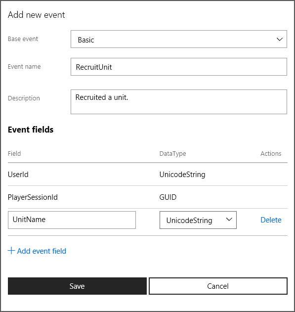

# Configure events in Partner Center

[!INCLUDE [reminder](../../includes/managed-creators-only-feature.md)]

This topic describes the procedures for adding and changing Xbox Events in the Partner Center service configuration for a title using data platform 2013. If a title is using data platform 2013, events are the key data sent by the title to Xbox services to update stats and leaderboards and to unlock achievements.

For an introduction to Xbox service configuration, see [Service configuration](/gaming/gdk/_content/gc/live/test-release/portal-config/live-service-config-ids-mp). For an introduction to Data Platform 2013, see the XDK topic **How the Xbox Live data platform 2013 works**.

## What is an event?  

An event is anything that happens during play and can be *captured*. A player acquiring a weapon is an event, and so is defeating an enemy by using that weapon.  

An event consists of the event name, an event description, and a number of fields that contain event-related data. When a title writes an event, the event is stored on the local device until it can be sent up to Xbox services. Xbox services receives the event and uses it to build and update stats, leaderboards, achievements, and other features of data platform 2013, according to the rules you define in the service configuration. For details, see the XDK topic **Game events**.

## Configure an event

1. Sign in with your account on [Partner Center](https://developer.microsoft.com/dashboard/windows/overview).

1. Select your title, and then go to **Services** > **Xbox Live**.

1. Select the link to **Stat rules**.

1. On the **Events and stat rules** page, configure the events and the stat rules according to the events.

## Create an event

   1. On the **Events and stat rules** page, select **New event**.

   1. In the dialog, specify the values for the following fields.

      *  **Base event**  
      From the dropdown list, select the base event on which you want to build your new event. The selected base event will control the default fields with which your new event will be prepopulated. You can add any other fields but can't remove the default ones.

      *  **Event name**  
         * Provide a name that characterizes the event and that you'll easily remember and recognize.
         * The event name doesn't have to match the name of the base event selected for the new event.  
         * Event names aren't displayed to the gamer and are internal to the code and game studio.  
         * Event names must be unique within a provider namespace: a single provider can't have two conflicting event names.  

      *  **Description**  
      Provide a brief description of the event. This text is optional and hidden from the gamer.

      *  **Event fields**  
         * The fields in this list represent the data that will be captured in connection with the new event.  
         * To add an event field, select **Add Event Field** and then specify the **Field** name and **DataType**.
         * There are character limits on the different types of fields.  

           *  Achievement name: 44  
           *  Locked description: 100  
           *  Unlocked description: 100  
           *  Achievement rule name: 44  
           *  In-app reward name: 57  
           *  In-app reward description: 90  
           *  Art reward name: 57  
           *  Art reward description: 90  
           *  Rich presence: 44  
           *  Hero stat name: 44  

   1. Select **Save** to create the event and close the dialog.

      

Your new event is now listed on the **Events and stat rules** page.

## Change an event  

> [!IMPORTANT]
>
> * After a title passes Final Certification, existing events in that title can no longer be changed except to add new event fields.  
> * It's possible to delete custom event fields but not the default event fields provided automatically when the event was created.   

   1. On the **Events and stat rules** page, under **Events**, select the name of the event you want to change.

   1. Make the changes in the **Update event** dialog.

   1. Select **Save**.

## Copy an event  

You can create a new event by copying an existing event and modifying its information for the new event.

   1. On the **Events and stat rules** page, under **Events**, select **Copy** for the event you want to copy.

   2. Provide the **Event name** for your new event.

   3. Update the description, and then add or remove the event fields as needed.

   4. Select **Save** to create the event and close the dialog.

## Delete an event  

> [!IMPORTANT]
>
> * After a title passes Final Certification, existing events in that title can no longer be deleted.
> * Deleting an event deletes any chained dependencies it might have. Before deleting an event, be sure that you also want to delete all its dependencies.
> * You can delete events while your game is in development but not after it has exited Final Certification&mdash;that is, after you've launched your product.

   1. On the **Events and stat rules** page, under **Events**, select **Delete** for the event you want to delete.

   1. In the **Confirmation** dialog, select **Delete** or **Cancel**.

 

## Download the Events Manifest file

After you finish defining and changing your title's events, you must publish them to Xbox Live and download the Events Manifest file, which you need in order to develop your title.  

For information about downloading the Events Manifest file, see [Downloading the Events Manifest file](how-to-download-events-manifest.md).
