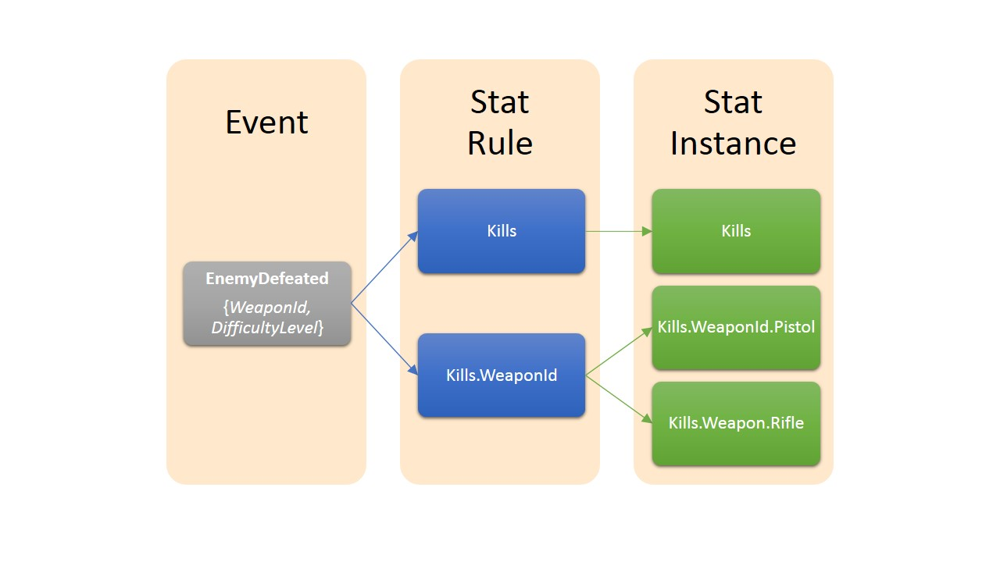
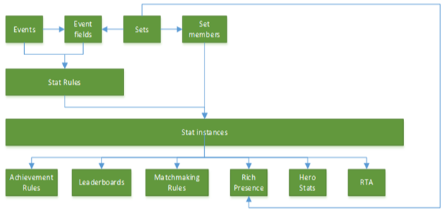

# Configure Xbox stats and stat rules in Partner Center

[!INCLUDE [reminder](../../includes/managed-creators-only-feature.md)]

This topic describes the procedures for adding and changing stat rules in the Partner Center service configuration for a title. Player stats are created and updated according to the stat rules triggered when a game sends events to the Xbox Live service.

For an introduction to Xbox service configuration, see [Service configuration](/gaming/gdk/_content/gc/live/test-release/portal-config/live-service-config-ids-mp). For an introduction to Data Platform 2013, see the XDK topic **How the Xbox Live data platform 2013 works**.

## What is a stat rule?  

Stat rules are triggered when an event with a particular name is received by the Xbox data platform service. Triggering of a stat rule (by sending an appropriate event) causes the service to create or update one or more player stats.

Player stats are defined by the developer, calculated by the Xbox Live data platform, and stored as name-value pairs on a per-user basis. Here are a few examples of player stats.

   *  Total number of zombies killed with a shotgun in hard difficulty
   *  Highest number of enemies defeated in a match
   *  Fastest time for completing a race
   *  Name of the car driven most recently

Player stats can be displayed on the player's game hub UI as featured or hero stats, displayed in leaderboards, and used to unlock achievements.

Individual stat rules can be configured to produce one of the following:  

   *  A single instance of a player stat  
   *  Multiple instances of a player stat that's based on a stat template  

For information about stats and stat rules, see the following topics in the XDK documentation.

* **User Stats for Data Platform 2013**
* **User Stat Rules**
* **User Stats Scenarios**

The following diagram demonstrates the flow of an event that triggers stat rules that update stat instances.

 

## Configure a stat rule

1. Sign in with your account on [Partner Center](https://developer.microsoft.com/dashboard/windows/overview).

1. Select your title, and then go to **Services** > **Xbox Live**.

1. Select the link to **Stat rules**.

1. On the **Events and stat rules** page, configure the events and the stat rules that are based on those events.

Because stat rules are based on events, you must create an event before you can create a stat rule. For details, see [Configure Xbox Live events for data platform 2013 in Partner Center](how-to-configure-events-2013.md).

## Create a stat rule

   1. On the **Events & Stat Rules** page, select **New stat rule**.

   1. In the **Add Stat Rule** dialog, specify the values for the following fields.  

      * **Base event**   
         In the dropdown list, select the base event that triggers this stat rule.

      *  **Event fields added to the stat rule**  
         - This optional field lets you select fields included in the base event as part of the stat rule. 
         - In the dropdown list, select a field to be added to the stat rule. You can add multiple fields this way. The selected fields will be appended to the stat rule's root name and separated by the dot character.
         - To remove a field, select the X next to its name.

      *  **Stat Rule Name**   
         Specify a name that characterizes the stat rule and that you'll easily remember and recognize. Names of stat rules are composed of a *root* name, optionally followed by one or more *fields* separated by the dot character. For the naming requirements of stat rule names, see the XDK topic **User Stat Rules**.

      *  **Operator**   
         Select one of the following operators.  

         *  **Sum**   
         Increment the existing stat value by the value specified in the **Parameter** field.  
 
         *  **Min**   
         Use the minimum of the existing stat value and the **Parameter** field's value.  
 
         *  **Max**   
         Use the maximum of the existing stat value and the **Parameter** field's value.  

         *  **Replace**   
          Replace the stat value with the value specified in the **Parameter** field.  

            We don't recommend using the **Replace** operator for stats that drive achievements. Events aren't always processed in order, and this might cause an achievement to never unlock. Instead, use the **SUM** operator.

      *  **Parameter**  
      Specify the value to be used in the operator selected in the **Operator** field.  

          * If you want to use a static number that you specify, select the **literal** option and then specify the value in the box below the option.  

          * If you want to use the value of a field, select the **field** option and, in the dropdown list below the option, select the field to be used.  

      * **Restrict other features like achievements and featured stats from accessing this info.**  
      Select this checkbox to make the stat rule private.

      * **Only allow changes to this stat from a server event. Client events will be ignored.**  
      Select this checkbox to indicate that the stat rule is triggered only by events sent via the server-to-server API, not from game clients running on the console or PC.

   1. After configuring all fields and values, select **Save** and then close the dialog.

Your new stat rule is now listed on the **Events & Stat Rules** page whenever the rule's event is selected.

## Change an existing stat rule  

> [!IMPORTANT]
> After a title passes Final Certification, existing stat rules for an event in that title can no longer be changed or deleted.  

   1. In the **Stat rules** column on the **Events and stat rules** page for the product instance, select the stat rule you want to change.  

   1. Make the changes in the **Update stat rule** dialog for the event.

   1. Select **Save**.

## Edit a stat rule

Editing a stat rule takes place when a stat rule's name or an event field has been removed, added, or reordered. This operation will be treated as a deletion and creation of a new stat rule. All stat instances will be deleted as part of editing, according to this definition.  

## Copy an existing stat rule  

> [!IMPORTANT]
> After a title passes Final Certification, existing stat rules for an event in that title can no longer be changed or deleted.  

   1. On the **Events and stat rules** page for the product instance, find the row with the stat rule you want to delete.

   2. Select **Copy** in the **Actions** column on that row.

   3. Make the changes in the **Update stat rule** dialog for the event.

   4. Select **Save**.

## Delete an existing stat rule  

> [!IMPORTANT]
> * After a title passes Final Certification, existing stat rules for an event in that title can no longer be changed or deleted. 
>  
> * Deletion of a stat rule is a permanent action and can't be undone or reversed.
>   
> * Deleting a stat rule deletes any chained dependencies it might have. Before deleting a stat rule, be sure that you also want to delete all its dependencies.

   1. On the **Events and stat rules** page for the product instance, find the row with the stat rule you want to delete.

   1. Select **Delete** in the **Actions** column on that row.

   1. Select **Delete** in the **Confirmation** dialog.

   
